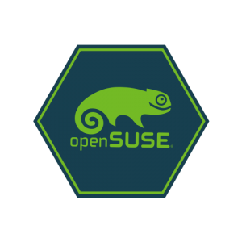

*30 octobre 2019 par [Douglas DeMaio](https://news.opensuse.org/author/ddemaio/ "Messages de Douglas DeMaio") - Traduction par sogal*

Depuis la dernière mise à jour, cinq instantanés d'[openSUSE](https://www.opensuse.org/) [Tumbleweed](https://en.opensuse.org/Portal:Tumbleweed) ont été publiés.

L'instantané [20191027](https://lists.opensuse.org/opensuse-factory/2019-10/msg00375.html), a mis à jour [KDE Plasma 5.17.1](https://kde.org/announcements/plasma-5.17.1.php). La mise à jour du correctif a corrigé le profil d’accélération Mouse KCM sur [X11](https://www.x.org/) sur [Plasma Desktop](https://kde.org/plasma-desktop) et corrigeait un problème de visibilité du bouton Aide contextuelle pour [KWIN](https://userbase.kde.org/KWin).

Une partie de la mise à jour de [Plasma 5.17.1](https://kde.org/announcements/plasma-5.17.1.php) est parvenue dans l'instantané[20191022](https://lists.opensuse.org/opensuse-factory/2019-10/msg00304.html) le jour de sa publication par le [projet KDE](https://kde.org/).
Le paquet [kcalendarcore](https://api.kde.org/frameworks/kcalendarcore/html/index.html) a été mis à jour vers [KDE Frameworks 5.63.0](https://kde.org/announcements/kde-frameworks-5.63.0.php), qui a atterri dans les instantanés de la semaine dernière.
Quelques paquets [YaST](https://en.wikipedia.org/wiki/YaST) sont également arrivés dans l'instantané. Certains de ces paquets YaST sont adaptés à la nouvelle gestion du clavier.

Les deux autres packages mis à jour dans l'instantané étaient destinés au décodeur AV1 [dav1d 0.5.1](https://code.videolan.org/videolan/dav1d), ce qui corrigeait un problème de construction dans [ARM64](https://en.wikipedia.org/wiki/ARM_architecture) si les informations de débogage étaient activées et la calculatrice, [qalculate 3.5.0](https://qalculate.github.io/downloads.html), qui contenait un correctif pour la conversion *steradian* liée à la surface d'une sphère.
Le [réviseur d'instantané Tumbleweed](http://review.tumbleweed.boombatower.com/) est en cours de réparation et n'a pas d'évaluation pour l'instantané.

Sept paquets sont arrivés dans l'instantané [20191025](https://lists.opensuse.org/opensuse-factory/2019-10/msg00365.html) et [openssh 8.1](https://www.openssh.com/txt/release-8.1) était un des changements majeurs.
Cette nouvelle version majeure a ajouté de nouvelles fonctionnalités telles qu'une signature expérimentale légère et une capacité de vérification. Selon le journal des modifications, "les signatures peuvent être effectuées à l'aide de [clés ssh](https://wiki.archlinux.org/index.php/SSH_keys) classiques conservées sur disque ou stockées dans un agent ssh et vérifiées par rapport à un fichier `authorized\_keys` (liste de clés autorisées). Les signatures intègrent un espace de noms qui évite la confusion et les attaques entre différents domaines d'utilisation (par exemple, les fichiers par rapport au courrier électronique).
L'hyperviseur [VirtualBox](https://www.virtualbox.org/) pour la virtualisation x86 a subi une mise à jour mineure vers la version 6.0.14; la version de maintenance corrigeait un problème potentiel dans la mise en réseau avec la signalisation d'interruption pour les cartes réseau des invités [UEFI](https://en.wikipedia.org/wiki/Unified_Extensible_Firmware_Interface).
Le paquet [Network Time Protocol](https://en.wikipedia.org/wiki/Network_Time_Protocol) [chrony 3.5](https://chrony.tuxfamily.org/download.html) a ajouté la prise en charge de l'horodatage du matériel sur les interfaces disposant d'une configuration de l'horodatage en lecture seule et paquet de programmation de mémoire persistante [pmdk](https://pmem.io/) 1.7 a introduit deux nouvelles [Interface de programme d'application](https://en.wikipedia.org/wiki/Application_programming_interface) (API) dans [librpmem](https://pmem.io/pmdk/libpmem/) et [libpmemobj](http://pmem.io/pmdk/libpmemobj/).

Une mise à jour de la bibliothèque graphique 3D de [Mesa](https://www.mesa3d.org/) est arrivée dans l'instantané [20191024](https://lists.opensuse.org/opensuse-factory/2019-10/msg00354.html). La version 19.2.1 des packages Mesa et Mesa-drivers a introduit plusieurs [nouvelles fonctionnalités](https://www.phoronix.com/scan.php?page=news_item&px=Mesa-19.2-Released) et une grande amélioration des performances pour les [GPU AMD](https://www.phoronix.com/scan.php?page=news_item&px=Mesa-Radeon-Boost-No-vRAM-Type).
Le [noyau Linux](https://www.kernel.org/) a été mis à jour vers la version 5.3.7 et contenait plusieurs correctifs pour la publication d'un périphérique USB.
Les autres paquets mis à jour dans l'instantanée étaient [libX11](https://gitlab.freedesktop.org/xorg/lib/libx11) 1.6.9, [libglvnd](https://github.com/NVIDIA/libglvnd) 1.2.0 et le système de fichiers distribué [openafs](https://www.openafs.org/) 1.8.5.

Les instantanés [20191023](https://lists.opensuse.org/opensuse-factory/2019-10/msg00342.html) et [20191022](https://lists.opensuse.org/opensuse-factory/2019-10/msg00304.html) étaient les deux derniers instantanés à être notés par le [relecteur Tumbleweed](http://review.tumbleweed.boombatower.com/) jusqu'à correction de ce dernier.
Respectivement, les deux avaient des notes de 85 et 70.

Seuls quelques paquets figuraient dans l'instantané [20191023](https://lists.opensuse.org/opensuse-factory/2019-10/msg00342.html) et [nodejs12 12.13.0](https://github.com/nodejs/node/blob/master/doc/changelogs/CHANGELOG_V12.md#12.8.1) était l’un des packages les plus importants de cette mise à jour; la nouvelle version [nodejs12](https://github.com/nodejs/node/blob/master/doc/changelogs/CHANGELOG_V12.md#12.8.1) adressait huit vulnérabilités communes et expositions (CVE), notamment "[Ping Flood](https://en.wikipedia.org/wiki/Ping_flood)" où un attaquant envoie des pings en continu à un homologue HTTP/2, l'amenant à créer une file d'attente interne de réponses.
Outre la livraison d’une mise à jour de [Plasma 5.17.1](https://kde.org/announcements/plasma-5.17.1.php) le jour de la publication de l'instantané [20191022](https://lists.opensuse.org/opensuse-factory/2019-10/msg00304.html), l'instantané a également apporté [libvirt 5.8.0](https://libvirt.org/news.html) et une mise à jour de l'outil de gestion du contrôle [mercurial 5.1. 2](https://www.mercurial-scm.org/).
