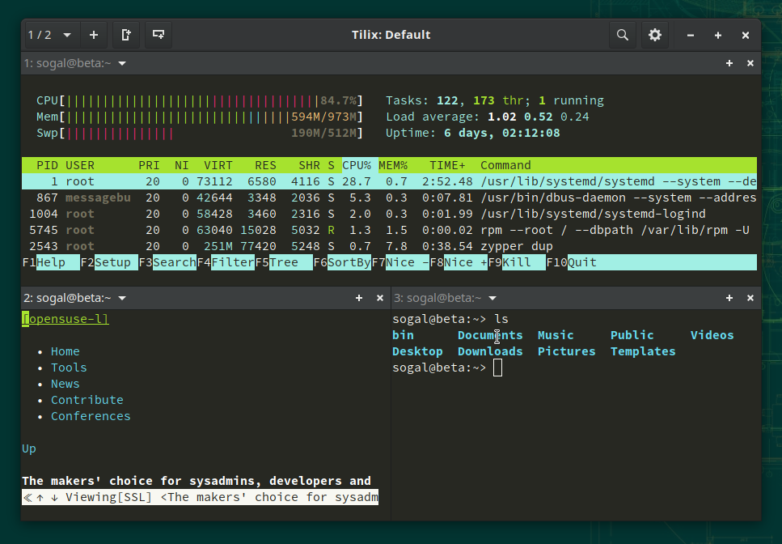
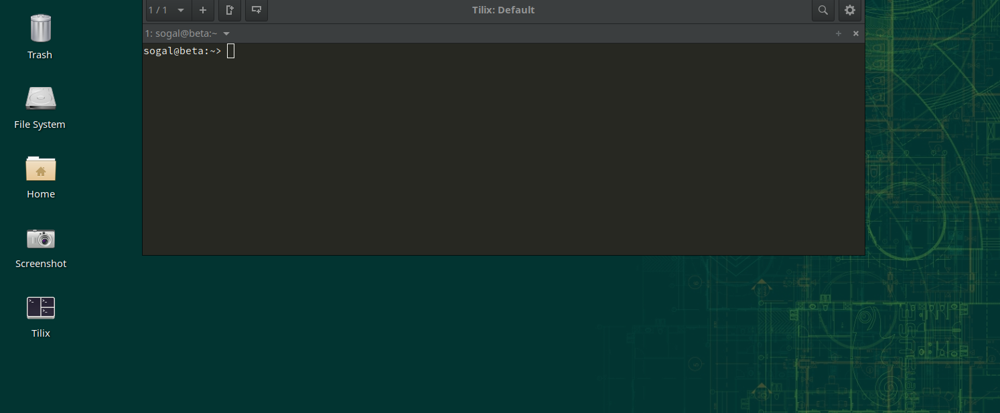
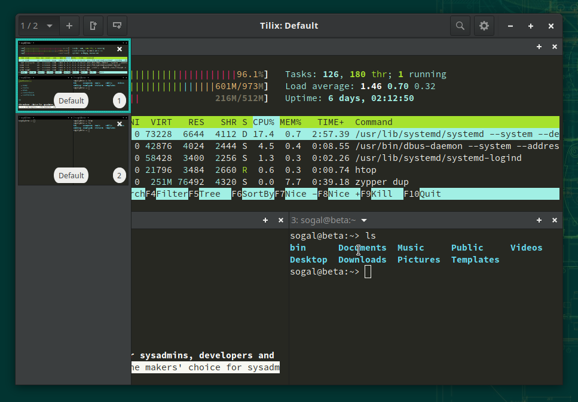
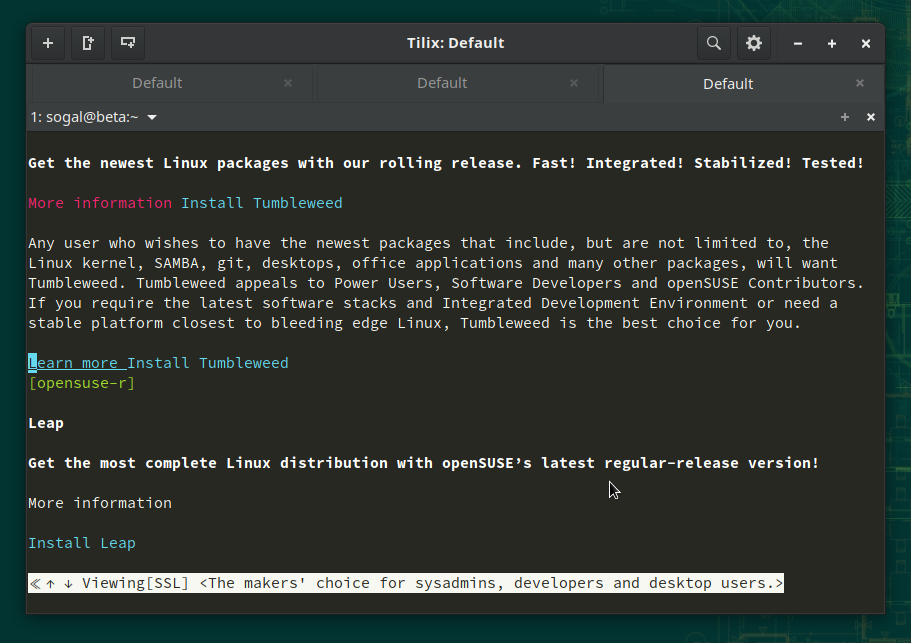
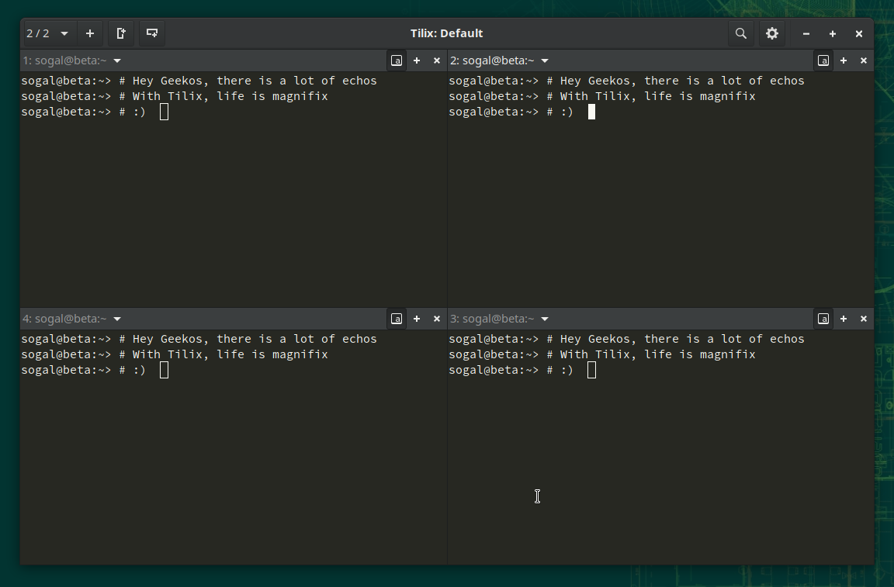
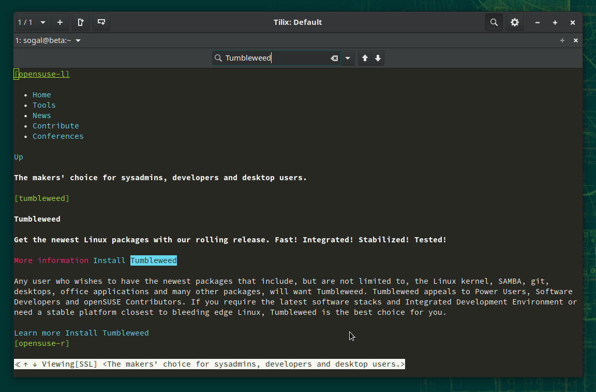
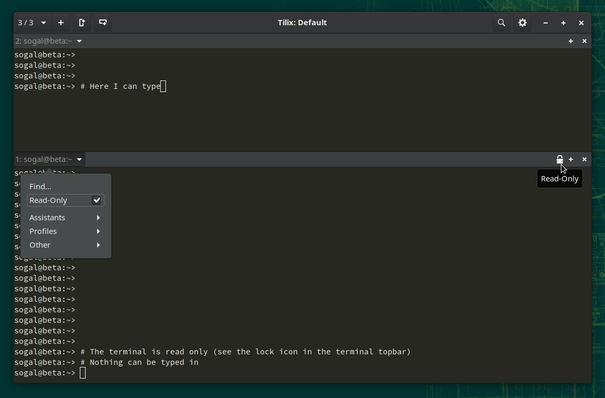
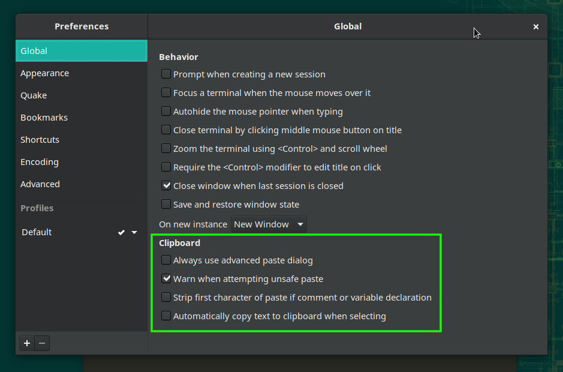
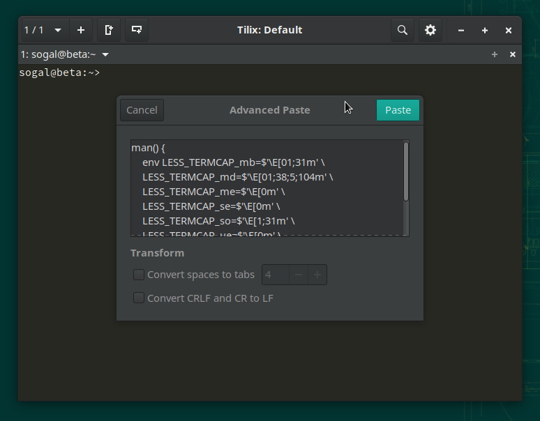
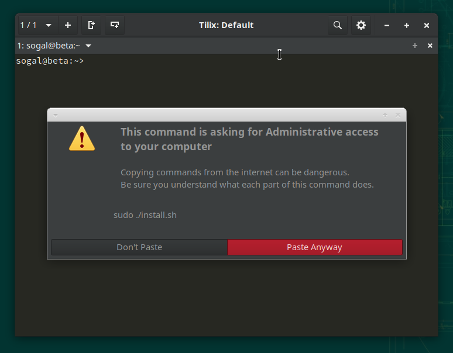

Aujourd'hui, nous présentons [Tilix](https://github.com/gnunn1/tilix) un émulateur de terminal scindable ainsi que quelques conseils qui font de ce terminal un excellent outil pour tous les utilisateurs, en particulier les administrateurs système. Pour rappel, Tilix (anciennement Terminix) est un émulateur de terminal utilisant [libvte](https://github.com/GNOME/vte) et écrit en [langage D](https://dlang.org/) avec une interface GTK3+. Il est donc spécialement conçu pour s'intégrer à GNOME.

Comme [Terminator](https://code.google.com/archive/p/jessies/wikis/Terminator.wiki), il peut être divisé, ce qui vous permet d'avoir plusieurs terminaux dans une seule fenêtre:

Il peut également remplacer Guake, car il fonctionne comme un terminal déroulant (cette fonctionnalité n'est pas disponible dans une session Wayland).

### Sessions

Vous pouvez avoir plusieurs sessions dans une même fenêtre Tilix. Une session est simplement un groupe de terminaux. Les sessions peuvent être affichées sous forme de barre latérale commutable:

Ou, de manière plus classique, sous forme d'onglets. Vous pouvez définir cela dans les Préférences (la modification de ce paramètre nécessite un redémarrage).

### Fractionner la fenêtre

Vous pouvez facilement diviser le terminal actuel en utilisant les boutons de la barre supérieure. Le terminal actuel peut être divisé verticalement ou horizontalement. Les nouveaux terminaux sont toujours créés en dessous ou à droite du terminal actif.

### Synchroniser l'entrée

Tilix nous permet de synchroniser certains terminaux d'une session. Cela signifie que tout ce que vous saisissez dans un terminal est également envoyé à tous les autres terminaux synchronisés. Ceci est particulièrement utile lorsque vous êtes connecté à plusieurs hôtes distants et que vous souhaitez leur envoyer les mêmes commandes.

### Rechercher du texte

Via l'icône de la loupe, vous pouvez rechercher du texte dans tout le texte sorti dans le terminal actuellement actif.

### Protégez les terminaux des erreurs

Lorsque vous travaillez beaucoup avec des émulateurs de terminaux, avec beaucoup d'entre eux ouverts, il est facile de commencer à taper le mauvais. Tilix vous permet de définir un terminal en **lecture seule** pour que rien de ce que vous saisirez n'ait d'effet (aucune séquence ne sera envoyée).

### Gestion avancée du presse-papiers

Tilix nous offre des options intéressantes de copier-coller. Elles doivent être activées dans les préférences:

### Dialogue de collage avancé

Vous pouvez configurer un raccourci pour l'afficher ou choisir de toujours l'afficher. Cette boîte de dialogue permet par exemple de configurer le nombre d'espaces dans les tabulations lors du collage:

Tilix a une fonctionnalité qui vous avertit lorsque vous collez une commande potentiellement dangereuse (à exécuter avec *sudo* par exemple). Ceci est utile lorsque vous suivez un tutoriel sur le Web sans réfléchir, mais ne fonctionne que lorsque la commande est suivie d'un saut de ligne, ce qui conduirait à son exécution immédiate:

*Avertissement en cas de collage dangereux:*

Ceci conclut notre présentation de Tilix. Dans l'article de la semaine prochaine, nous approfondirons et explorerons ses fonctionnalités avancées.
Spoiler: il y en a beaucoup! Restez à l'écoute.