La semaine dernière, nous avons présenté Tilix et commencé à explorer ses bases, intéressons-nous maintenant aux fonctionnalités avancées de Tilix, à savoir:

* Gestion des signets, locaux ou distants;
* Liens personnalisés (liens cliquables basés sur des expressions régulières);
* Changement de profil automatique en fonction de l'emplacement (local ou distant (SSH));
* Gestion des mots de passe;
* Lancement d'actions internes.

## Gestion des signets

Tilix vous permet d'enregistrer et de gérer une liste de **signets**, c'est-à-dire des emplacements locaux ou distants. Ouvrez simplement les *Préférences* et définissez un dossier ou des serveurs distants auxquels vous connecter, puis ouvrez cette liste, sélectionnez le signet souhaité pour accéder immédiatement au dossier ou ouvrez la session SSH vers un hôte distant.

*Remarque: les signets sont enregistrés dans `$HOME/.config/tilix/bookmarks.json`, nous vous recommandons de créer ce fichier à la main au préalable si vous remarquez que vos signets ne sont pas enregistrés correctement après avoir quitté Tilix.*

### Créer un dossier de signets

Tilix vous permet d'organiser vos signets en créant un dossier simple dans lequel vous pouvez les créer, afin qu'ils soient bien organisés. Cela est utile, par exemple, pour regrouper des connexions SSH vers le même groupe de machines:

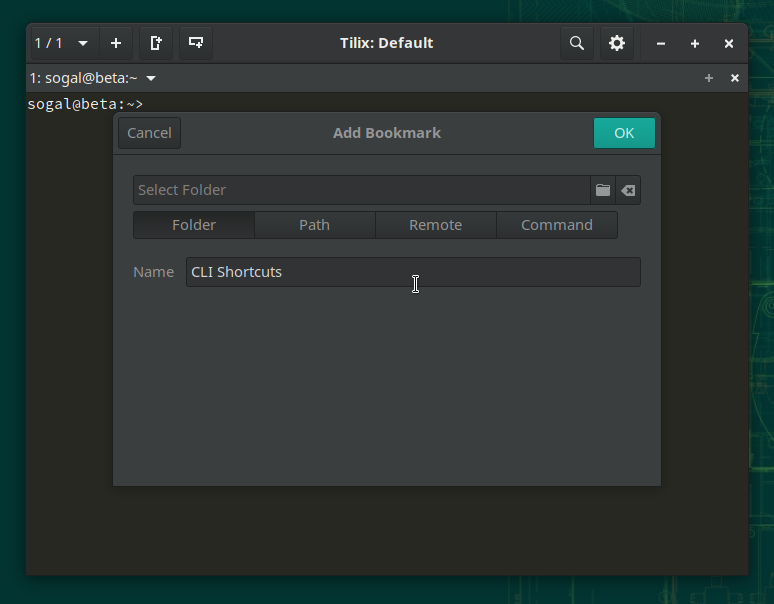

Cliquez sur le dossier puis sur **+** pour ajouter des signets.

### Signets locaux

Pour ajouter des signets, ouvrez les préférences Tilix, puis allez dans la section Signets pour cliquer sur **+**.

Ici, nous allons ajouter un signet à la copie locale d'un projet sur le service Open Build.

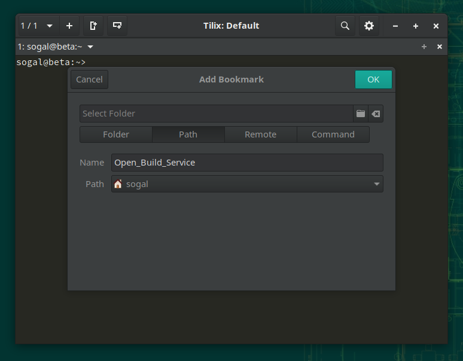

### Signets distants

La procédure est la même, mais choisissez *Remote* puis entrez les paramètres du signet:

* Nom: la référence de votre marque-page;
* Protocole: choix: SSH, SFTP, TELNET, FTP;
* Hôte: le nom d'hôte de la cible suivi du numéro de port;
* Utilisateur: l'utilisateur de la connexion;
* Paramètres: options SSH par exemple;
* Commande: s'il s'agit d'une connexion SSH, la commande à lancer sur l'hôte distant.

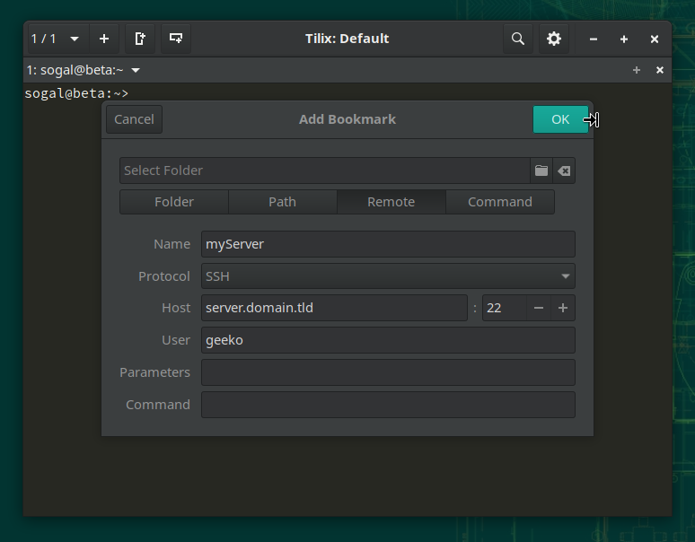

### Commandes

Même procédure que les autres, mais ici on saisit simplement une commande à lancer, le bookmark est donc ici un simple alias.

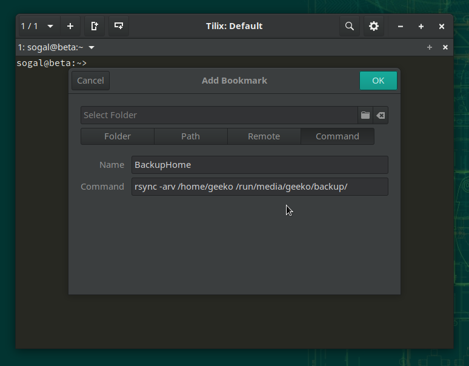

Ma commande pour mettre à jour la copie locale de mon référentiel OBS.

### Utiliser des signets

Vous pouvez accéder à vos favoris via `Ctrl + Maj + B`, il vous suffit de le sélectionner et la commande correspondante est lancée:

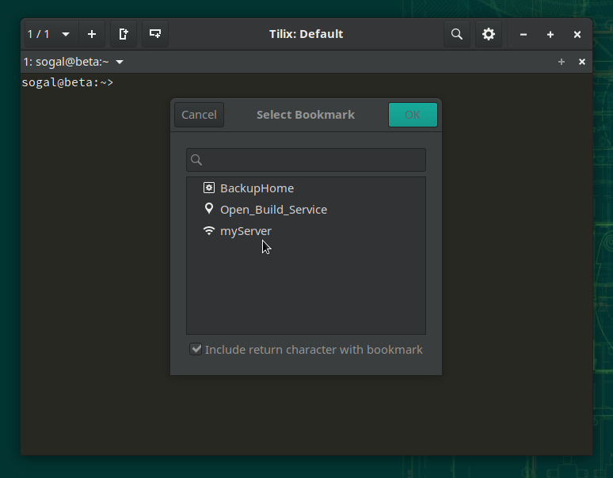

## Liens personnalisés

Tilix vous permet de définir une liste de liens (URI vers une page Web ou un emplacement local ou distant `file://`) qui seront rendus cliquables sur la base d'une expression régulière ou d'un simple mot.
Pour ce faire, ouvrez les Préférences puis la section Avancé. Pour l'exemple, nous allons ajouter un lien vers le service Open Build avec la clé work *obs*;

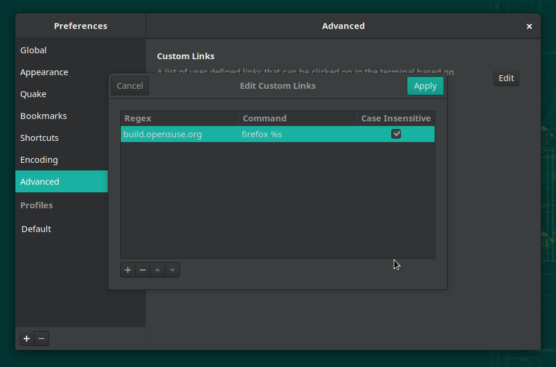

L'expression régulière est devenue cliquable, soit par `Ctrl + clic`, soit par un clic droit.

## Changement automatique de profil

On arrive ici dans une fonctionnalité de Tilix qui est particulièrement utile et qui peut éviter de faire de graves erreurs en tapant une commande dans le mauvais répertoire ou dans une connexion à distance: le changement automatique de profil.
Tilix, comme de nombreux émulateurs de terminaux modernes, vous permet de créer plusieurs profils (couleurs, shell utilisé, police etc ...) mais en plus, il permet de basculer automatiquement de l'un à l'autre en fonction de l'emplacement actif, soit un dossier local ou, plus intéressant mais nécessitant un peu plus de manipulation, une connexion SSH.

### Local

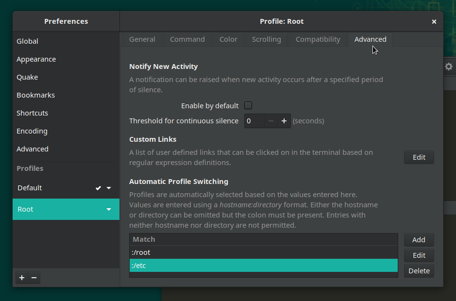

Pour l'exemple, nous allons créer un profil appelé "Root" qui sera activé automatiquement lorsque nous explorerons l'un des dossiers suivants:

    /etc
    / usr
    /racine

Maintenant, dans l'onglet "Avancé" du profil, nous allons définir la condition nécessaire à son activation.

Comme spécifié, les valeurs doivent être au format "hôte:dossier" ou "hôte:" ou ": dossier", les ":" sont obligatoires, donc "hôte" ou "dossier" seuls ne sont pas autorisés.

Et maintenant, si nous allons dans `/etc`:

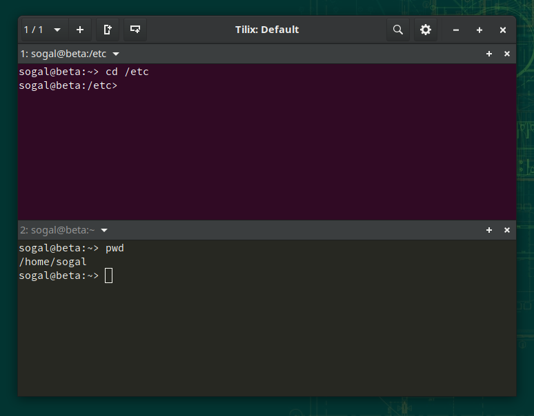

Le basculement a été effectué automatiquement et dès que nous quitterons `/etc`, Tilix utilisera à nouveau le profil par défaut.

### Pendant une connexion à distance

Tilix nous permet de faire de même lors d'une connexion SSH. Mais cela nécessite un peu de configuration sur l'hôte distant:

*Copie du script sur l'hôte distant:*

Vous devez pousser le script `/usr/share/tilix/scripts/tilix_int.sh` dans le `$HOME` de l'utilisateur distant (ou dans tout autre dossier d'où il peut provenir comme `/usr/local/bin` ):

    scp /usr/share/tilix/scripts/tilix_int.sh user@hostname:/home/user

Connectez-vous ensuite au préalable pour ajouter le lancement du script à la connexion, via son `.bashrc` par exemple:

    [geeko@host ~] $ cat .bashrc
    # .bashrc
    # Alias ​​et fonctions spécifiques à l'utilisateur
    . ./tilix_int.sh

Définissez ensuite, là aussi, la condition de changement de profil comme ci-dessus mais en spécifiant l'hôte (celui fourni par la commande hostname sur laquelle se base Tilix) cette fois puis connectez-vous. Le profil changera dès que la connexion SSH sera établie. Il reviendra au profil par défaut dès que nous nous déconnectons.

## Gestion des mots de passe

Tilix vous permet également de stocker des mots de passe en mémoire. Pour ce faire, cliquez sur le menu du terminal actif et choisissez "Mots de passe ...":

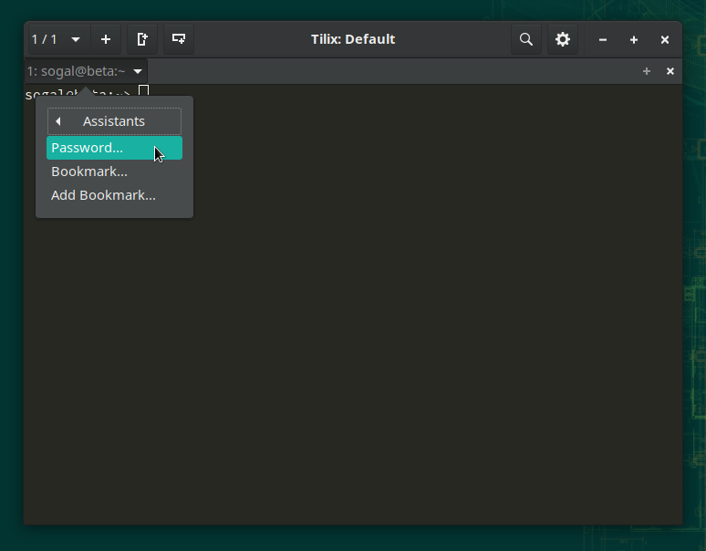

Et remplissez-le:

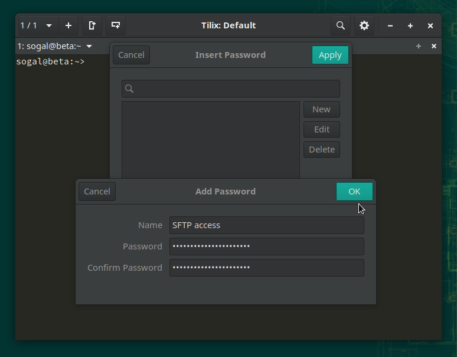

Tilix conserve les mots de passe enregistrés dans le trousseau de clés GNOME.

Il s'agit d'une fonction très intéressante couplée aux précédentes:

* en utilisant des signets, vous lancez une connexion à distance;
* grâce aux mots de passe enregistrés vous déverrouillez votre clé SSH par exemple;
* puis Tilix vous bascule immédiatement sur le profil de votre choix si nécessaire.

## Lancement d'actions internes

Dans une session Tilix en cours, il vous permet de lancer des actions internes qui peuvent être utiles, par exemple, pour diviser la fenêtre en deux, puis ouvrir un programme X dans la tuile créée:

    tilix -a session-add-right -e htop

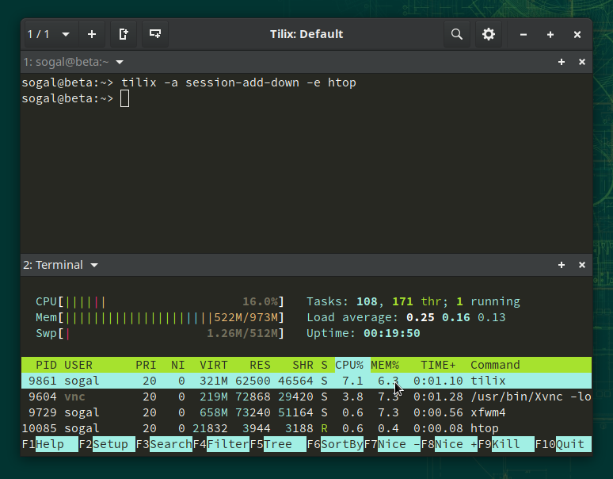

Cette fonctionnalité est très utile lorsqu'elle est couplée à un alias ou enchaînée, vous permettant de créer votre disposition de session et de démarrer vos applications.

## En conclusion

Tilix a été activement développé et est maintenant considéré comme mature. Nous espérons que cette revue de ses fonctionnalités avancées vous aura convaincu, ou du moins vous aura donné envie de l'essayer.

*A bientôt. Have fun !*