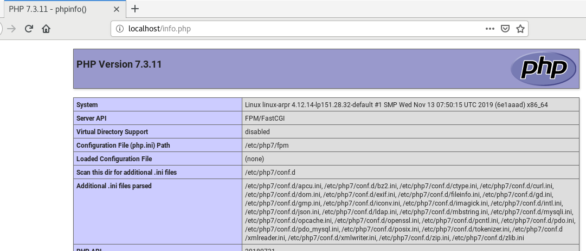

*Ce tutoriel est issu d'un [post sur le forum](https://www.alionet.org/index.php?topic=54.0) par squid-f qui nous partage ici sa procédure d'installation. Merci à lui !* 

En fait, il y a beaucoup de tutos pour ubuntu mais très peu pour openSUSE, d'où ce tutoriel pour openSUSE Leap 15.1.

Avant de commencer, voici les sources qui m’ont bien aidé :

* [https://www.c-rieger.de/nextcloud-installation-guide-ubuntu-18-04](https://www.c-rieger.de/nextcloud-installation-guide-ubuntu-18-04)
* [https://decatec.de/home-server/nextcloud-auf-ubuntu-server-18-04-lts-mit-nginx-mariadb-php-lets-encrypt-redis-und-fail2ban](https://decatec.de/home-server/nextcloud-auf-ubuntu-server-18-04-lts-mit-nginx-mariadb-php-lets-encrypt-redis-und-fail2ban)
* [https://www.howtoforge.com/tutorial/owncloud-nginx-opensuse-leap-42.1](https://www.howtoforge.com/tutorial/owncloud-nginx-opensuse-leap-42.1)
* [https://nextcloud.com/support](https://nextcloud.com/support)

## Installation de NGINX et PHP

J’ai choisi d’installer une autre version de **php-fpm** que celle d’origine de Leap 15.1 car le module _password_ de Nextcloud ne va bientôt plus supporter **php-fpm7.2**. 

La version 7.3 sera installée grâce à (**php7-apcu** et **imagick** sont dans le dépôt  _extensions_) :

```
zypper ar -f http://download.opensuse.org/repositories/devel:/languages:/php/openSUSE_Leap_15.1/ php-devel

zypper addrepo https://download.opensuse.org/repositories/server:php:extensions:php7/php7_openSUSE_Leap_15.1/server:php:extensions:php7.repo

zypper refresh

```

## Installation de nginx

`zypper in nginx`


## Installation de PHP

En disséquant la documentation de Nextcloud, j’ai abouti à la liste et l’installation des modules suivants :

```
zypper in php7 php7-APCu php7-bz2 php7-ctype php7-curl php7-dom php7-exif php7-fileinfo php7-fpm php7-gd php7-gmp php7-iconv php7-imagick php7-intl php7-json php7-ldap php7-mbstring php7-mysql php7-opcache php7-openssl php7-pcntl php7-pdo php7-posix php7-tokenizer php7-xmlreader php7-xmlwriter php7-zip php7-zlib ffmpeg-3
```

## Tests initiaux NGINX et PHP-FPM

### Test de NGINX

* Créer _/srv/www/htdocs/index.html_ avec `sudo nano /srv/www/htdocs/index.html` et coller le code suivant :

```
<html>

<body>

<h1> NGINX fonctionne </h1>

</body>

</html>

```


* Editer _/etc/nginx/nginx.conf_ avec `sudo nano /etc/nginx/nginx.conf`

Ajouter _index.php_ dans la ligne ci-dessous vers le début du fichier :

`index index.html index.htm index.php; `

enlever les symboles " # " de commentaire dans le bloc ci-dessous :

```
location ~ \.php$ {

root /srv/www/htdocs/;

fastcgi_pass 127.0.0.1:9000;

fastcgi_index index.php;

fastcgi_param SCRIPT_FILENAME /scripts$fastcgi_script_name;

include fastcgi_params;

}

```


* Tester la syntaxe des modifications avec la commande ci-dessous qui ne doit pas renvoyer d’erreur :

`sudo nginx -t`


* Démarrer le service

```
sudo systemctl enable nginx

sudo systemctl start nginx
```

* Dans votre navigateur internet, taper l’adresse `localhost` et le message « NGINX fonctionne » doit apparaître

### Premier paramétrage et test de PHP-FPM

* Créer _/srv/www/htdocs/info.php_ avec ‘sudo nano /srv/www/htdocs/info.php’ et coller le code suivant :

```
<?php

phpinfo();

?>
```

* Initialiser les fichiers de configuration

```
sudo cp /etc/php7/fpm/php-fpm.conf.default /etc/php7/fpm/php-fpm.conf

sudo cp /etc/php7/fpm/php-fpm/php-fpm.d/www.conf.default /etc/php7/fpm/php-fpm/php-fpm.d/www.conf
```

* Editer _php-fpm.conf_ ‘sudo nano /etc/php7/fpm/php-fpm.conf’ et décommenter en enlevant le symbole # de la ligne ci-dessous :

`error_log = log/php-fpm.log`

* Editer www.conf `sudo nano /etc/php7/fpm/php-fpm.d/www.conf` et modifier comme ci-dessous, en changeant user et groupet en enlevant le symbole de commentaire qui est cette fois `;` pour d’autres lignes :

```
user = nginx
group = nginx
listen.owner = nginx
listen.group = nginx
listen.mode = 0660
```

Pour améliorer la performance, continuer à modifier `www.conf` de façon à écouter un socket et non un port. Pour cela, commenter avec `;` la ligne `listen = 127.0.0.1:9000` et ajouter une ligne pour pointer vers un socket :

```
;listen = 127.0.0.1:9000
listen = /var/run/php-fpm.sock
```

Pour être cohérent en PHP-FPM et NGINX quant à l’écoute d’un socket, il faut re-éditer _/etc/nginx/nginx.conf_ et modifier comme suit le bloc `location ~ \.php$` en ajoutant la ligne `fastcgi_pass` pointant le même socket que dans www.conf :

```
location ~ \.php$ {
    root /srv/www/htdocs/;
    #fastcgi_pass 127.0.0.1:9000;
    fastcgi_pass unix:/var/run/php-fpm.sock;
    fastcgi_index index.php;
    fastcgi_param SCRIPT_FILENAME $document_root$fastcgi_script_name;
    include fastcgi_params;
}
```

* Initialiser le service :

```
sudo systemctl enable php-fpm
sudo systemctl start php-fpm
```

* Dans votre navigateur internet, taper l’adresse `localhost/info.php` pour avoir des informations sur la configuration php installée.



Maintenant que nous nous sommes assurés que NGINX et PHP-FPM fonctionnent, nous allons avancer dans leur optimisation et finir l’installation de NEXTCLOUD

## Optimisation de NGINX

### Modification du fichier /etc/nginx/nginx.conf

C’est le fichier de configuration de NGINX commun à tous les serveurs qui seront installés. Nous allons modifier les paramètres suivants :

* **user** : utilisateur du serveur web : nginx

* **worker_processes** : nombre de coeurs du CPU : auto

* **pid** : j’ai décommenté la ligne mais je n’ai pas trouvé d’explication. Je suis preneur d’information !

* **server_tokens** : mettre à off pour la sécurité en limitant les informations fournies par nginx.

* **TCP_NOPUCH, TCP_NODELAY, SENDFILE** : en les combinant on peut gagner jusqu’à 0,2s lors de l’envoi des données.


Editer le fichier _nginx.conf_ précédemment modifié `sudo nano /etc/nginx/nginx.conf`

et rechercher et ajuster les lignes comme suit :

```
user nginx;
worker_processes auto;
pid /var/run/nginx.pid;
tcp_nopush on;
tcp_nodelay on;
server_tokens off; 
```

## Test & Restart NGINX&nbsp;:

```
sudo nginx -t 
sudo systemctl restart nginx
```

Si vous obtenez un message d’erreur, revérifier vos modifications.

## Optimisation de PHP

### Modification du fichier /etc/php7/fpm/php-fpm.d/www.conf


* Optimisation de la mémoire utilisé par le serveur.

* Il faut ajuster le nombre maximum de requêtes en fonction de la mémoire allouée au serveur.

* J’ai limité le nombre maximum pm.max_children à 150 en utilisant la formule ci-dessous :

* `Max Processes = (mémoire allouée au serveur) / (mémoire occupées par processus php)`

En allouant 5Go de ram à mon serveur et avec une taille de 35Mo par requête PHP, cela donne : (1024\*5) / 35 = 146, que j’ai arrondi à 150.

* Environment Variables: NEXTCLOUD à besoin de ces variables.

* Prévention d’un timeout de nextcloud à l’installation

Donc, éditer www.conf précédemment modifié `sudo nano /etc/php7/fpm/php-fpm.d/www.conf`

puis chercher et ajuster les lignes du fichier comme suit : 

```
pm.max_children = 150
pm.start_servers = 20
pm.min_spare_servers = 10
pm.max_spare_servers = 20
pm.max_requests = 500
env[HOSTNAME] = $HOSTNAME
env[PATH] = /usr/local/bin:/usr/bin:/bin
env[TMP] = /tmp
env[TMPDIR] = /tmp
env[TEMP] = /tmp
; ajout de la ligne ci-dessous pour éviter timeout nextcloud
request_terminate_timeout = 300
```

## Modification du fichier /etc/php7/cli/php.ini

Les paramètres suivant vont être ajustés :

* cgi.fix_pathinfo : pour améliorer la sécurité = 0
* expose_php = off évite d’avoir accès à la version de php depuis l’extérieur
* Plus d’autres paramètres d’optimisation de fonctionnement (memory_limit = 512M est demandé par NEXTCLOUD).

Le fichier _php.ini_ existe déjà dans le répertoire _/etc/php7/cli_ 

Sauvegarder la version d’origine par `sudo cp /etc/php7/cli/php.ini /etc/php7/cli/php.ini.ori` 

Editer le fichier `sudo nano /etc/php7/cli/php.ini`

Chercher et ajuster les lignes du fichier comme suit : 

```
implicit_flush = Off
expose_php = Off
max_execution_time = 1800
max_input_time = 3600
memory_limit = 512M
html_errors = On
register_argc_argv = Off
post_max_size = 10240M
cgi.fix_pathinfo=0
upload_max_filesize = 10240M
max_file_uploads = 100
date.timezone = Europe/Paris
opcache.enable=1
opcache.enable_cli=1
opcache.memory_consumption=128
opcache.interned_strings_buffer=8
opcache.max_accelerated_files=10000
opcache.revalidate_freq=1
opcache.save_comments=1
```

## Création du fichier /etc/php7/fpm/php.ini

A l’installation, ce fichier n’existe pas. J’ai donc juste copié le fichier php.ini du répertoire /etc/php7/cli que nous venons de modifier.

`sudo cp /etc/php7/cli/php.ini /etc/php7/fpm`

## Modification de /etc/php7/fpm/php-fpm.conf

Pour faire redémarrer FPM en cas d’erreurs répétées dans un laps de temps.

Sauvegarder la version d’origine par `sudo cp /etc/php7/fpm/php-fpm.conf /etc/php7/fpm/php-fpm.conf.ori` 

Editer le fichier par `sudo nano /etc/php7/fpm/php-fpm.conf`

Rechercher et ajuster les lignes du fichier comme suit : 

```
pid = /var/run/php-fpm.pid
error_log = /var/log/php-fpm.log
emergency_restart_threshold = 10
emergency_restart_interval = 1m
process_control_timeout = 10s
```

## Mise à jour permission répertoire de gestion des sessions PHP

Important car cela peut empêcher la connexion à Nextcloud malgré les bons noms d’utilisateur et leurs mots de passe. Il faut donner l’accès à l’utilisateur du serveur NGINX.

`sudo chown -R nginx:nginx /var/lib/php7`

## Création hôte virtuel Nextcloud dans NGINX

Nous avançons maintenant dans le spécifique pour Nextcloud.

A noter que mon serveur nextcloud sera appelé par un sous-répertoire de mon nom domaine : * https://mon_domaine/nextcloud *

Il ne faudra pas oublier d’ajuster ce paramètre en fonction de votre propre domaine.

Mon fournisseur internet (free) me permet de créer gratuitement un nom de domaine (avec extension hd.free.fr) qui pointe vers mon serveur. Il ne faudra pas oublier sur la freebox de faire un transfert de port vers l’adresse IP de la machine qui sert de serveur.

Créer le fichier /etc/nginx/vhosts.d/nextcloud.conf (c’est une version sans certificat SSL car certbot s’en chargera ensuite) par `sudo nano /etc/nginx/vhosts.d/nextcloud.conf`

puis coller le code suivant (n’oublier pas de changer pour votre nom de domaine) :

```
upstream php-handler {
#server 127.0.0.1:9000;
server unix:/var/run/php7.2-fpm.sock;
}

server {
    listen 80;
    listen [::]:80;
    server_name mon_domaine ;
# Add headers to serve security related headers
# Before enabling Strict-Transport-Security headers please read into this
# topic first.<
#add_header Strict-Transport-Security "max-age=15768000; includeSubDomains; preload;" always;
#
# WARNING: Only add the preload option once you read about
# the consequences in https://hstspreload.org/. This option
# will add the domain to a hardcoded list that is shipped
# in all major browsers and getting removed from this list
# could take several months.
    add_header Referrer-Policy "no-referrer" always;
    add_header X-Content-Type-Options "nosniff" always;
    add_header X-Download-Options "noopen" always;
    add_header X-Frame-Options "SAMEORIGIN" always;
    add_header X-Permitted-Cross-Domain-Policies "none" always;
    add_header X-Robots-Tag "none" always;
    add_header X-XSS-Protection "1; mode=block" always;
# Remove X-Powered-By, which is an information leak
    fastcgi_hide_header X-Powered-By;
# Path to the root of your installation
    root /srv/www;
    location = /robots.txt {
        allow all;
        log_not_found off;
        access_log off;
    }
# The following 2 rules are only needed for the user_webfinger app.
# Uncomment it if you're planning to use this app.
#rewrite ^/.well-known/host-meta /nextcloud/public.php?service=host-meta last;
#rewrite ^/.well-known/host-meta.json /nextcloud/public.php?service=host-meta-json last;
# The following rule is only needed for the Social app.
# Uncomment it if you're planning to use this app.
#rewrite ^/.well-known/webfinger /nextcloud/public.php?service=webfinger last;
    location = /.well-known/carddav {
        return 301 $scheme://$host:$server_port/nextcloud/remote.php/dav;
    }
    location = /.well-known/caldav {
        return 301 $scheme://$host:$server_port/nextcloud/remote.php/dav;
    }
    location /.well-known/acme-challenge { }
    location ^~ /nextcloud {
# set max upload size
        client_max_body_size 10240M;
        fastcgi_buffers 64 4K;
# Enable gzip but do not remove ETag headers
        gzip on;
        gzip_vary on;
        gzip_comp_level 4;
        gzip_min_length 256;
        gzip_proxied expired no-cache no-store private no_last_modified no_etag auth;
        gzip_types application/atom+xml application/javascript application/json application/ld+json application/manifest+json application/rss+xml application/vnd.geo+json application/vnd.ms-fontobject application/x-font-ttf application/x-web-app-manifest+json application/xhtml+xml application/xml font/opentype image/bmp image/svg+xml image/x-icon text/cache-manifest text/css text/plain text/vcard text/vnd.rim.location.xloc text/vtt text/x-component text/x-cross-domain-policy;
# Uncomment if your server is build with the ngx_pagespeed module
# This module is currently not supported.
#pagespeed off;
        location /nextcloud {
            rewrite ^ /nextcloud/index.php;
        }
        location ~ ^\/nextcloud\/(?:build|tests|config|lib|3rdparty|templates|data)\/ {
            deny all;
        }
        location ~ ^\/nextcloud\/(?:\.|autotest|occ|issue|indie|db_|console) {
            deny all;
        }
        location ~ ^\/nextcloud\/(?:index|remote|public|cron|core\/ajax\/update|status|ocs\/v[12]|updater\/.+|oc[ms]-provider\/.+)\.php(?:$|\/) {
            fastcgi_split_path_info ^(.+?\.php)(\/.*|)$;
            set $path_info $fastcgi_path_info;
            try_files $fastcgi_script_name =404;
            include fastcgi_params;
            fastcgi_param SCRIPT_FILENAME $document_root$fastcgi_script_name;
            fastcgi_param PATH_INFO $path_info;
# Avoid sending the security headers twice
            fastcgi_param modHeadersAvailable true;
            <nowiki># Enable pretty urls</nowiki>
                fastcgi_param front_controller_active true;
            fastcgi_pass php-handler;
            fastcgi_intercept_errors on;
            fastcgi_request_buffering off;
            fastcgi_read_timeout 300;
        }
        location ~ ^\/nextcloud\/(?:updater|oc[ms]-provider)(?:$|\/) {
            try_files $uri/ =404;
            index index.php;
        }
# Adding the cache control header for js, css and map files
# Make sure it is BELOW the PHP block
        location ~ ^\/nextcloud\/.+[^\/]\.(?:css|js|woff2?|svg|gif|map)$ {
            try_files $uri /nextcloud/index.php$request_uri;
            add_header Cache-Control "public, max-age=15778463";
# Add headers to serve security related headers It is intended
# to have those duplicated to the ones above)
# Before enabling Strict-Transport-Security headers please read
# into this topic first.
#add_header Strict-Transport-Security "max-age=15768000; includeSubDomains; preload;" always;
#
# WARNING: Only add the preload option once you read about
# the consequences in https://hstspreload.org/. This option
# will add the domain to a hardcoded list that is shipped
# in all major browsers and getting removed from this list
# could take several months.
            add_header Referrer-Policy "no-referrer" always;
            add_header X-Content-Type-Options "nosniff" always;
            add_header X-Download-Options "noopen" always;
            add_header X-Frame-Options "SAMEORIGIN" always;
            add_header X-Permitted-Cross-Domain-Policies "none" always;
            add_header X-Robots-Tag "none" always;
            add_header X-XSS-Protection "1; mode=block" always;
# Optional: Don't log access to assets
            access_log off;
        }
        location ~ ^\/nextcloud\/.+[^\/]\.(?:png|html|ttf|ico|jpg|jpeg|bcmap)$ {
            try_files $uri /nextcloud/index.php$request_uri;
# Optional: Don't log access to other assets
            access_log off;
        }
    }
}
```

## Pare-feu

Avec Yast, autoriser http et https.

Cela servira à avoir accès au serveur Nextcloud mais c’est aussi nécessaire pour l’installation et le renouvellement du certificat SSL.

## Install Letsencrypt avec Certbot

On peut obtenir un certificat SSL gratuitement grâce à Let’s Encrypt.

Installation du client certbot conseillé par Let’s Encrypt. J’installe aussi le plugin nginx qui fera la modification du fichier nextcloud.conf

`sudo zypper in python3-certbot-nginx`


Pour obtenir le certificat, lancer la commande suivante et en remplaçant **mon_email** et **mon_domaine** par les vôtres :

`sudo certbot --nginx --agree-tos --redirect --hsts --staple-ocsp --email mon_email -d mon_domaine --rsa-key-size 4096`

## Modification du ficher SSL créé par CERTBOT

CERTBOT crée le fichier /etc/letsencrypt/options-ssl-nginx.conf qui va contenir des informations sur la cyrptographie utlisée.

Pour suivre la recommendation de sites comme SSLAB d’arrêter d’utiliser TLSv1

Editer le fichier `sudo nano /etc/letsencrypt/options-ssl-nginx.conf`

et remplacer : 

`ssl_protocols TLSv1 TLSv1.1 TLSv1.2;`

par : 

`ssl_protocols TLSv1.3 TLSv1.2;`

## cron de renouvellement des certificats

En effet, au bout de 3 mois le certificat expire. Il faut le renouveler et pour cela un script cron est créé.

Créer script cron certbot à placer dans /etc/cron.weekly/

`sudo nano /etc/cron.weekly/certbot`

puis coller le script suivant :

```
#!/bin/sh

# Stop nginx first
systemctl stop nginx

# Renew certs
certbot --nginx renew

# Restart nginx
systemctl start nginx
```

Penser à le rendre exécutable:
`chmod +x /etc/cron.weekly/certbot`


## Installation de MariaDB

Pour gérer la base de données des utilisateurs Nextcloud.

Installation par : `zypper in mariadb`

puis initialiser le service par : `sudo systemctl start mysql`

##Securisation de MariaDB

Executer la commande : `sudo mysql_secure_installation`

Vous allez devoir répondre aux questions comme suit :

```
Switch to unix_socket authentication [Y/n] N

Enter current password for root (enter for none): <ENTER> 

Set root password? [Y/n] Y

   (Entrer votre mot de passe et s’en rappeler)

Remove anonymous users? [Y/n] Y

Disallow root login remotely? [Y/n] Y

Remove test database and access to it? [Y/n] Y

Reload privilege tables now? [Y/n] Y

```


## Création de la base de données

• Nom de la base de données : **nextcloud**

• Son administrateur **nextcloud_admin**

• le mot de passe associé **admin_password**

Executer la commande&nbsp;: `sudo mysql -uroot -p`

Puis enter la commande:

```
CREATE DATABASE nextcloud CHARACTER SET utf8mb4 COLLATE utf8mb4_general_ci; CREATE USER nextcloud_admin@localhost identified by 'admin_password'; GRANT ALL PRIVILEGES on nextcloud.* to nextcloud_admin@localhost; FLUSH privileges; quit;
```

## Installation serveur Nextcloud

* Télécharger l’archive depuis le site de Nextcloud et la décompresser

* Copier le répertoire nextcloud dans /srv/www (ATTENTION : l’archive décompressée contient un sous-répertoire avant celui de nextcloud…)

* Puis autoriser l’accès à nginx : `chown -R nginx:nginx /var/www/nextcloud`

J’ai placé la base donner nextcloud dans un répertoire en-dehors de /srv/www/nextcloud 

J’ai créé le répertoire **/data/nextcloud_data** pour cela : 

`sudo mkdir /data/nextcloud_data`

puis

`sudo chown -R nginx:nginx /data/nextcloud_data`

Lancer ensuite un navigateur internet (firefox par exemple) et taper l’adresse : *https://mon_domaine/nextcloud*


Vous obtiendrez l’interface de configuration de nextcloud. 

Il faut créer l’utilisateur administrateur et entrer les informations de la configuration de la base de données mysql créée précédemment dans la section MariaDB.


## Ajout d’un cronjob pour Nextcloud

Je dirais que c’est la maintenance automatique du serveur. Dans la documentation de Nextcloud il s’appelle cela le ménage de la maison (housekeeping operation).

```
su -
crontab -u nginx -e
```

et entrer la ligne suivante :

`*/5 * * * * php -f /srv/www/nextcloud/cron.php > /dev/null 2>&1`

## APCU cache pour Nextcloud

Pour améliorer les performances, ajouter à la fin (et avant `);`) du fichier /srv/nextcloud/config/config.php :

`'memcache.local' => '\OC\Memcache\APCu',`

## fail2ban

C’est pour bannir les adresses IP de personnes malveillantes qui tenteraient de s’identifier sur le serveur.

Au bout de 3 tentatives infructueuses de connexion, l’adresse IP sera bannie.

* Installation de fail2ban : `zypper in fail2ban`

*(7 paquets d'installés : ed fail2ban libgamin-1-0 python2-pyinotify python2-systemd python-gamin whois)*

* Créer le fichier `/etc/fail2ban/filter.d/nextcloud.conf` par `sudo nano /etc/fail2ban/filter.d/nextcloud.conf`

et coller les lignes suivantes :

```
[Definition]
failregex=^{"reqId":".*","remoteAddr":".*","app":"core","message":"Login failed: '.*' \(Remote IP: '<HOST>'\)","level":2,"time":".*"}$
^{"reqId":".*","level":2,"time":".*","remoteAddr":".*","app":"core".*","message":"Login failed: '.*' \(Remote IP: '<HOST>'\)".*}$
^.*\"remoteAddr\":\"<HOST>\".*Trusted domain error.*$
```

* Création d’un nouveau fichier prison pour nextcloud : `sudo nano /etc/fail2ban/jail.d/nextcloud.local` et y copier les lignes suivantes :

```
[nextcloud]
backend = auto
enabled = true
port = 80,443
protocol = tcp
filter = nextcloud
maxretry = 3
bantime = 36000
findtime = 36000
logpath = /data/nextcloud_data/nextcloud.log
[nginx-http-auth]
enabled = true 
```

* Redémarrer fail2ban-service et vérifier son statut :

```
sudo systemctl restart fail2ban
sudo fail2ban-client status nextcloud
```

Qui donne le résultat suivant :

```
Status for the jail: nextcloud
|- Filter
| |- Currently failed:0
| |- Total failed:0
| `- File list:/data/nextcloud_data/nextcloud.log
`- Actions
|- Currently banned:0
|- Total banned:0
`- Banned IP list:
```


* Pour contrôler les IP bannies

`sudo fail2ban-client status nextcloud `

* Pour autoriser à nouveau une IP

`sudo fail2ban-client set nextcloud unbanip ip_address`

* Pour ne pas se bloquer en local

Editer le fichier /etc/fail2ban/jail.local&nbsp;: `sudo nano /etc/fail2ban/jail.local `

et ajouter votre plage d’IP local (chez moi, toutes mes adresses IP locales sont en 192.168.0.x)

`ignoreip = 192.168.0.0/16`

Vous pouvez aussi par la suite faire en sorte que fail2ban vous envoie un email en cas de blocage (configurer postfix pour cela).


Et voilà. Pour moi cela fonctionne du tonnerre. J’espère que cela pourra aider quelqu’un à se lancer !
N’oublier pas de faire des sauvegardes régulières de vos données et serveurs (voir documentation sur nextcloud.com).

Bien entendu, comme dit la maxime de nos jours, je me dois de décliner toute responsabilité en cas de perte de données ou de réinstallation du système...